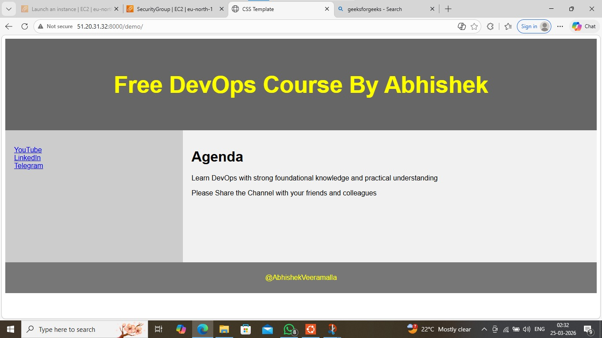
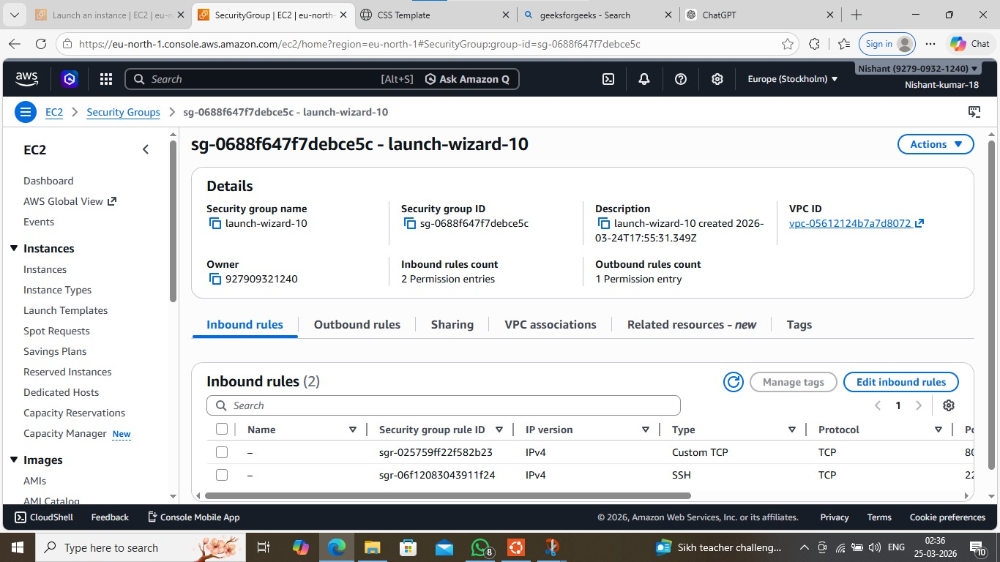

🚀 Django Application Deployment using Docker & AWS EC2

📌 Project Overview

This project demonstrates how to containerize and deploy a Django web application using Docker on an AWS EC2 instance. The application is successfully exposed to the internet using public IP and port mapping.

---

🛠️ Tech Stack

- Python (Django)
- Docker
- AWS EC2
- Linux

---

⚙️ Steps Performed

1️⃣ Dockerization

- Created a Dockerfile for Django application
- Installed dependencies using requirements.txt
- Exposed port 8000

2️⃣ Build Docker Image

docker build -t django-app .

3️⃣ Run Container

docker run -p 8000:8000 django-app

4️⃣ AWS EC2 Setup

- Launched EC2 instance
- Connected using SSH
- Installed Docker

5️⃣ Security Group Configuration

- Allowed inbound traffic on port 8000

6️⃣ Deployment

- Ran Docker container on EC2
- Accessed application using public IP

---

🌐 Live Demo

http://51.20.31.32:8000/demo/

---

## 📸 Screenshots

### 🌐 Live Application

### 🐳 Docker Running

### ☁️ AWS Security Group

---

🧠 Key Learnings

- Docker containerization
- Port mapping and networking
- AWS EC2 deployment
- Debugging real-world issues

---

🔥 Future Improvements

- CI/CD using GitHub Actions / Jenkins
- Use Nginx + Gunicorn
- Add custom domain

---

👨‍💻 Author

Nishant Kumar
